# FOC

## 一，***==硬件==***

### 1，概述：

​	这块FOC开发板我采用**STM32F405**作为主控，DRV8313作为驱动芯片，最大3A电流，引出了3路SPI接口，使用SWD烧录程序，电流采样使用INA240(超贵一颗，下次不用这个了)，使用USB口进行串口通讯
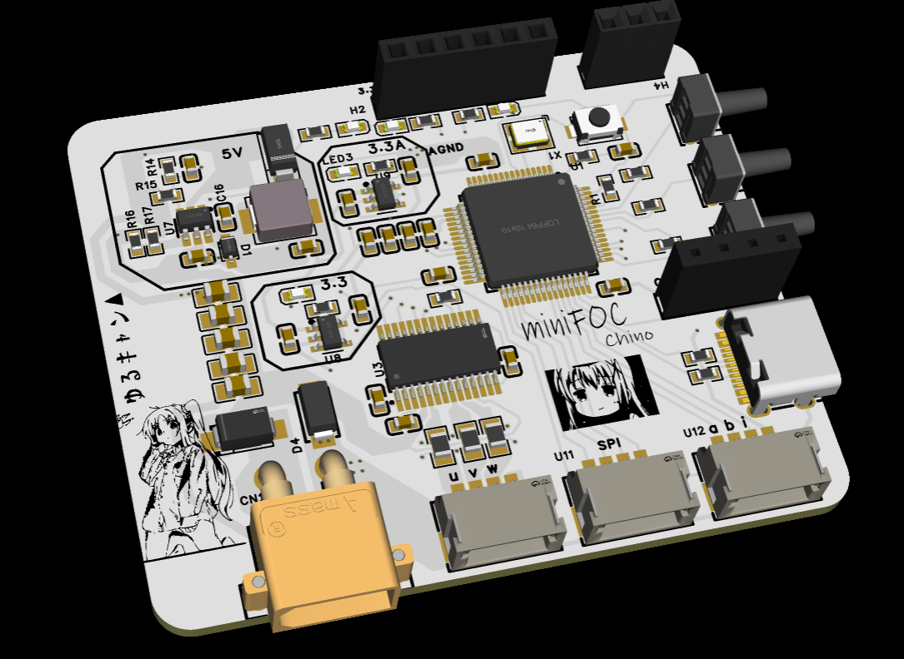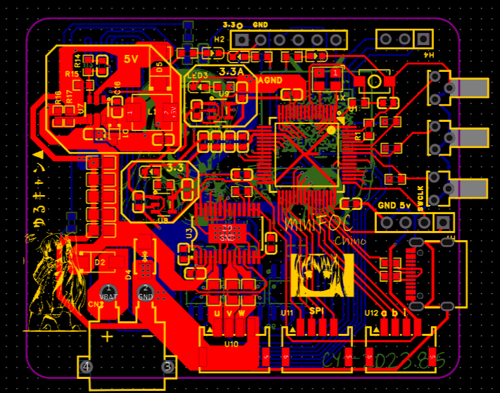

### 2，电源

整体采用DCDC和LDO供电
输入电压的范围在<u>3.3V~36V</u>之间。DCDC输出5V的电压供给两个LDO，输出一个3.3D和一个3.3A
模拟地和数字地通过0R电阻相连
这版电源接线端子画反了，下版记得改过来。
在电源输入处接了一个TVS和防反接二极管保护

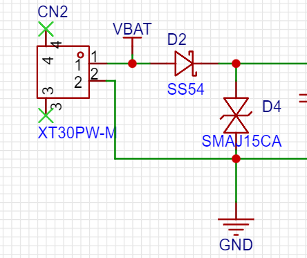

### 3，DRV8313外围电路

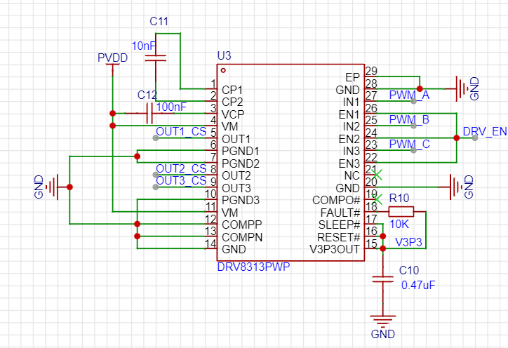

### 4，采样电路

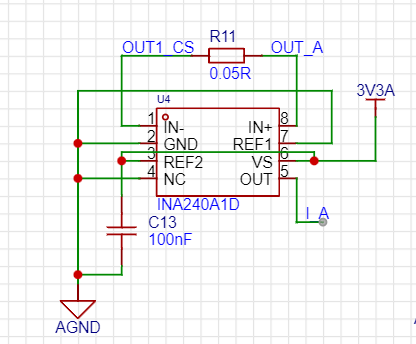

采用定时器编码器模式读取AB相，但是得注意一个定时器只有两个通道读AB相
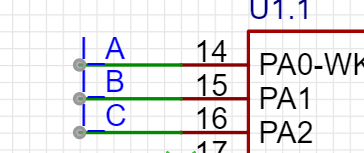

### 5，SPI接口

做这个开发版的一个目的就是学习硬件SPI所以全引出来了

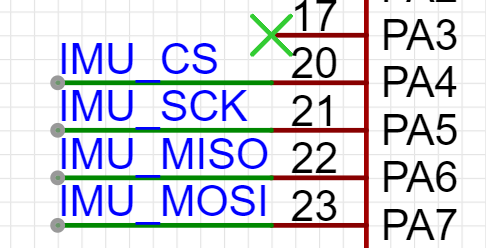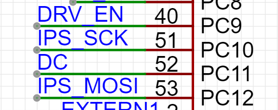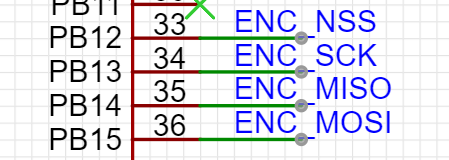

### 6,  USB口做虚拟串口

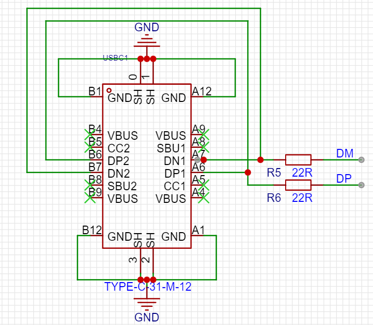

### 7，IPS屏幕

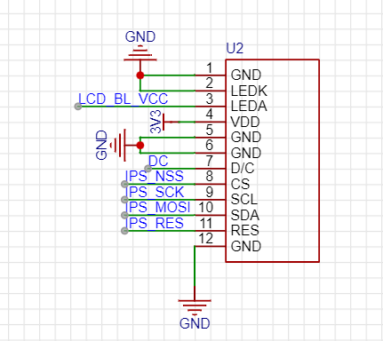

买的中景园的焊接式lcd屏，还没焊上去测试，因为还没接SD卡

### 8,	SD卡槽

我还在考虑是外接SD卡槽还是板载SD卡槽，用SPI模式还是SD模式，之后在考虑

### 9，晶振电路

md我用的是有源晶振，结果买成无源晶振了，差点把板子干烧了
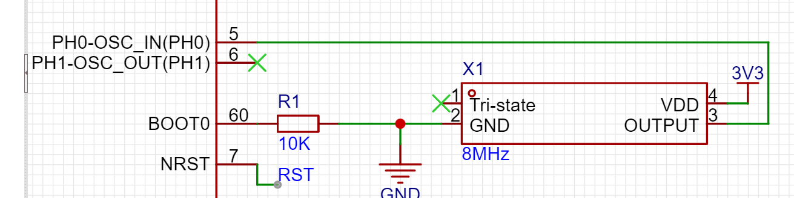

不需要外围电路
