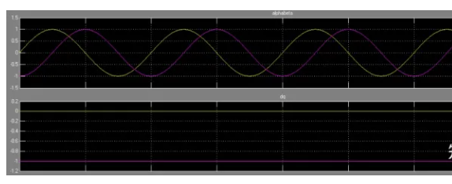
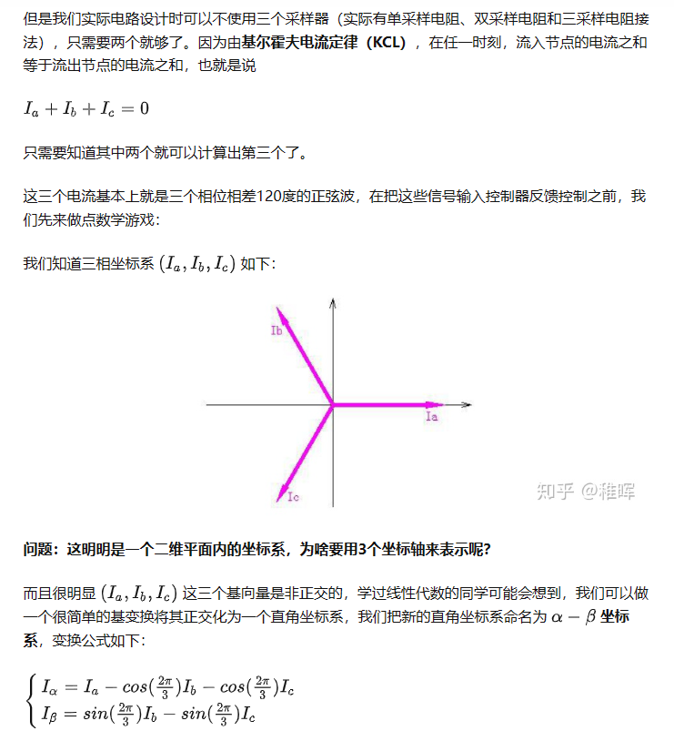
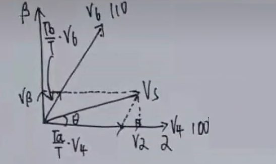
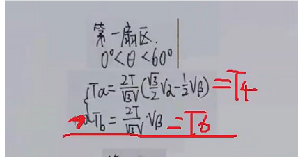
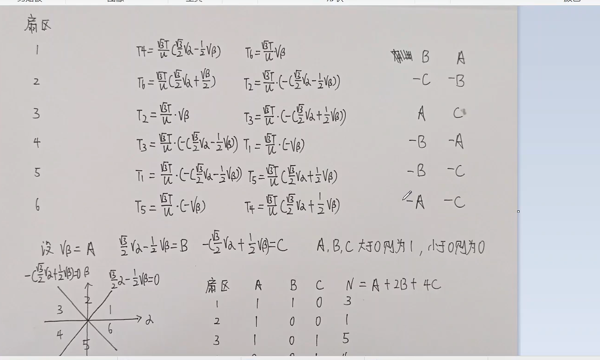
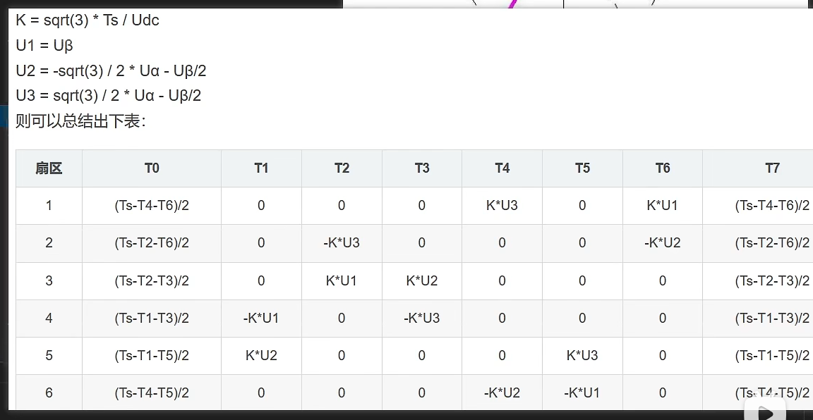

# FOC

## 一，***==硬件==***

### 1，概述：

​	这块FOC开发板我采用**STM32F405**作为主控，DRV8313作为驱动芯片，最大3A电流，引出了3路SPI接口，使用SWD烧录程序，电流采样使用INA240(超贵一颗，下次不用这个了)，使用USB口进行串口通讯


### 2，电源

整体采用DCDC和LDO供电
输入电压的范围在<u>3.3V~36V</u>之间。DCDC输出5V的电压供给两个LDO，输出一个3.3D和一个3.3A
模拟地和数字地通过0R电阻相连
这版电源接线端子画反了，下版记得改过来。
在电源输入处接了一个TVS和防反接二极管保护


### 3，DRV8313外围电路


### 4，采样电路


采用定时器编码器模式读取AB相，但是得注意一个定时器只有两个通道读AB相


### 5，SPI接口

做这个开发版的一个目的就是学习硬件SPI所以全引出来了


### 6,  USB口做虚拟串口


### 7，IPS屏幕


买的中景园的焊接式lcd屏，还没焊上去测试，因为还没接SD卡

### 8,	SD卡槽

我还在考虑是外接SD卡槽还是板载SD卡槽，用SPI模式还是SD模式，之后在考虑

### 9，晶振电路

md我用的是有源晶振，结果买成无源晶振了，差点把板子干烧了


不需要外围电路

## 二，算法

### 	1，Park变换

```c
void Park_change_Contrary()//Park逆变换
{
	Ualpha=-Uq*sin(Aangle_Now);
	Ubata= Uq*cos(Aangle_Now);
	
}
```

它的作用就是通过编码器读取电机的时时电角度，将正弦量转化成常量


DQ为旋转坐标轴，目标适量是随DQ轴转动的，形成正弦信号，然后将他投影到Beta和alpha轴的常量

### 2，Clark变换

​	这个很简单，不做过多解释。目的是将三相电流转换成两相


### 3，扇区划分

```C
u1=Ubata;
u2=squrt3*Ualpha/2-Ubata/2;
u3=-squrt3*Ualpha/2-Ubata/2;
```





通过投影的方式，将目标向量分解到Alpha和Beta轴上，每个扇区对于一个A B C的组合值，从而来区分扇区



通过扇区划分后，计算得到的时间就能生成马鞍波了
